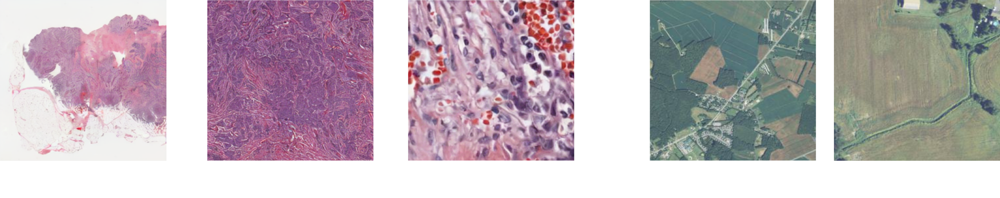
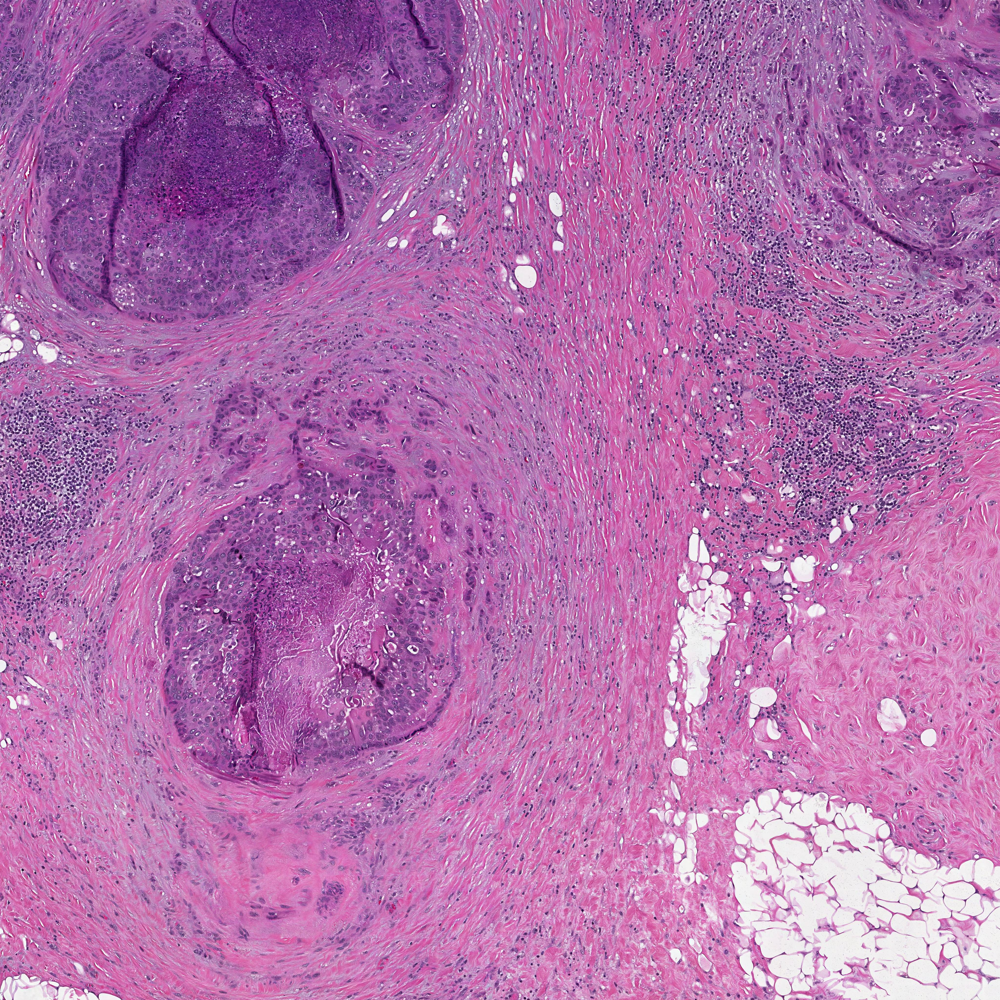
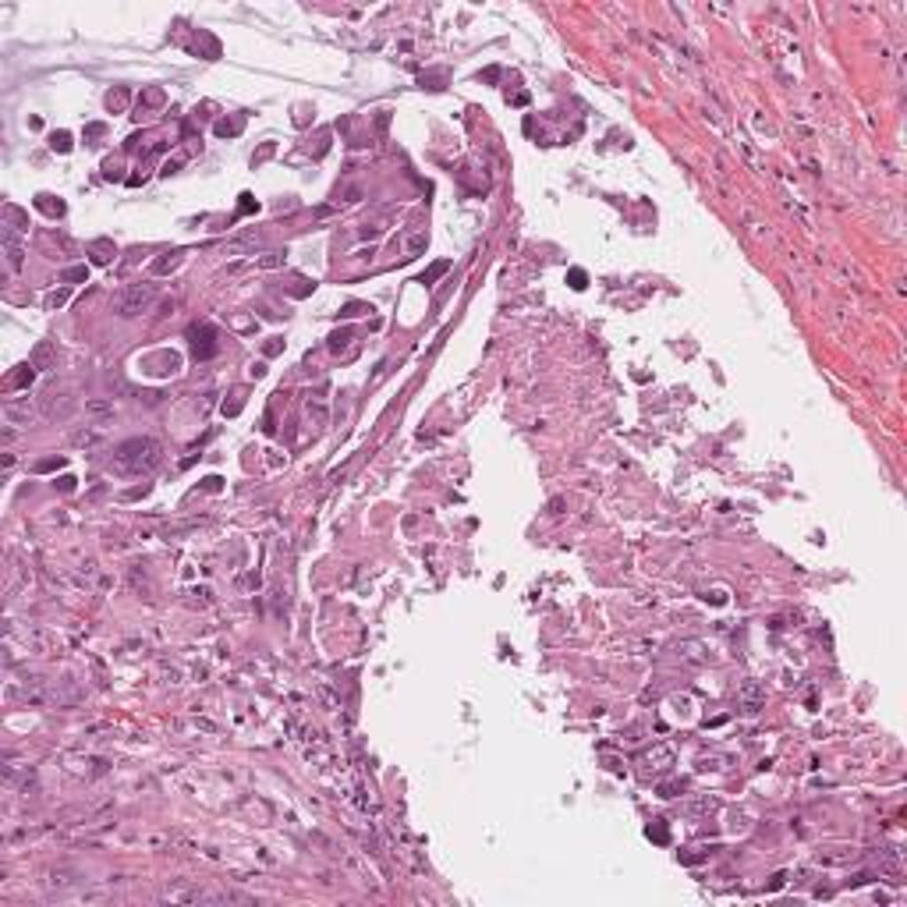
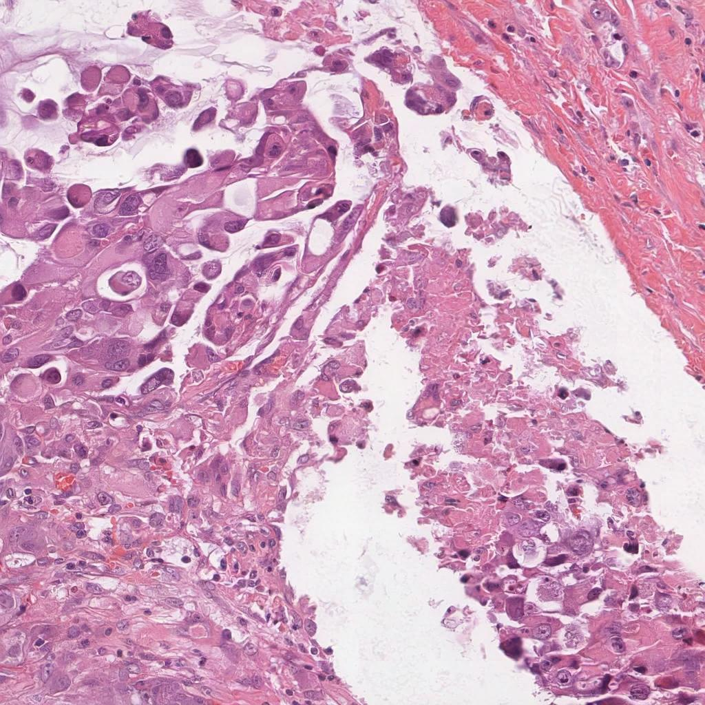

# ZoomLDM: Latent Diffusion Model for multi-scale image generation 


### <div align="center"> CVPR 2025 <div>

<div align="center">
    <a href="https://histodiffusion.github.io/docs/projects/zoomldm/"></a> &ensp;
    <a href="https://arxiv.org/abs/2411.16969"></a> &ensp;
    <a href="https://huggingface.co/StonyBrook-CVLab/ZoomLDM"></a> &ensp;
    <a href="https://huggingface.co/datasets/StonyBrook-CVLab/ZoomLDM-demo-dataset"></a> &ensp;
    <a href="https://histodiffusion.github.io/pages/zoomldm_large_images/large_images.html"></a> &ensp;
</div>

## Setup

```bash
git clone https://github.com/cvlab-stonybrook/ZoomLDM/
conda activate zoomldm
pip install -r requirements.txt
```
The model weights are hosted on [huggingface](https://huggingface.co/StonyBrook-CVLab/ZoomLDM). The inference scripts we provide below download the model weights using [huggingface hub](https://huggingface.co/docs/hub/index).

## Inference

### Patch level generation
<center>
<a href="./assets/patches.png">

</a>
</center>
<br>
<br>

We demonstrate patch-level generation at any scale in [`sample_patches_brca.ipynb`](./notebooks/sample_patches_brca.ipynb) and [`sample_patches_naip.ipynb`](./notebooks/sample_patches_naip.ipynb).

### Large image generation
<center>
<a href="./assets/brca_001.jpeg">
 
</a>
<a href="./assets/naip_001.jpg">
 
</a>
</center>
<br>
<br>

For large image generation, we use the proposed joint multi-scale sampling algorithm.

We provide an implementation of the algorithm in [`joint_multiscale.ipynb`](./notebooks/joint_multiscale.ipynb).

You can find more examples of large images [here](https://histodiffusion.github.io/pages/zoomldm_large_images/large_images.html).


### Super-resolution
<center>
<a href="./assets/lr.jpg">
 
</a>
<a href="./assets/sr.jpg">
 
</a>
</center>
<br>
<br>

Super-resolution uses the condition inversion algorithm proposed in the paper and with the joint multi-scale sampling to enforce the low-resolution constraint.

We prove an implementation in [`superres.ipynb`](./notebooks/superres.ipynb).


## Training

To train the model, you need to prepare a multi-scale dataset of {images, conditioning}. 

### Patch extraction 


We use the codebase of [DS-MIL](https://github.com/binli123/dsmil-wsi) to extract regions from the WSIs, first at the base 20x magnification. The patches range from 256x256 to 32768x32768 pixels. You might want to use a lower tissue threshold for larger images.

The following command will extract 1024x1024 patches at 20x:

```bash
python deepzoom_tiler.py -m 0 -b 20 -s 1024
```

> Refer to [this issue](https://github.com/cvlab-stonybrook/ZoomLDM/issues/4) for satellite image patch extraction.

### Feature extraction

#### Histopathology 
We pre-extract UNI embeddings (conditioning) from the full resolution images in a patch-based manner. A 2048x2048 image would result in 64x256x256 patches -> 64x1024 UNI embedding.

We then resize images to 256x256, extract VAE features, and save them together with the UNI embeddings. 

> For NAIP, we use the pre-trained DINO-v2 ViT-Large [(dinov2_vitl14_reg)](https://github.com/facebookresearch/dinov2?tab=readme-ov-file#pretrained-backbones-via-pytorch-hub) checkpoint to extract embeddings.

Please take a look at the demo datasets: [brca](https://huggingface.co/datasets/StonyBrook-CVLab/ZoomLDM-demo-dataset-BRCA)/[naip](https://huggingface.co/datasets/StonyBrook-CVLab/ZoomLDM-demo-dataset-NAIP) or our dataloader scripts: [brca](./ldm/data/brca.py)/[naip](./ldm/data/naip.py) for more details.


### Training
Create a config file similar to [this](./configs/zoomldm_brca.yaml), which specifies the dataset, model, and training parameters.

Then, run the training script:

```bash 
python main.py -t --gpus 0,1,2 --base configs/zoomldm_brca.yaml
```

## Bibtex
```bibtex
@InProceedings{Yellapragada_2025_CVPR,
  author = {Yellapragada, Srikar and Graikos, Alexandros and Triaridis, Kostas and Prasanna, Prateek and Gupta, Rajarsi and Saltz, Joel and Samaras, Dimitris},
  title = {ZoomLDM: Latent Diffusion Model for Multi-scale Image Generation},
  booktitle = {Proceedings of the Computer Vision and Pattern Recognition Conference (CVPR)},
  month = {June},
  year = {2025},
  pages = {23453-23463}
}
```
